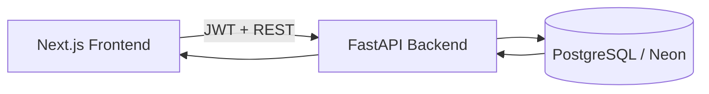

# Indpro Flow

A deployment-ready Kanban task manager engineered for fast execution, reliable state transitions, and a polished product experience.

## Demo
- Live App: [Frontend URL Placeholder](https://your-frontend-url.com)
- API Base URL: [Backend URL Placeholder](https://your-backend-url.com/api)
- API Docs (Swagger): [Docs URL Placeholder](https://your-backend-url.com/docs)

## Screenshots
- Board Overview: 
- Auth (Login/Register): 
- Edit + Drag & Drop: 

## Core Features
- Authentication: Register and login with JWT-based auth.
- Task CRUD: Create, update, delete tasks with backend persistence.
- Stage-based workflow: Todo, In Progress, Done.
- Drag-and-drop movement across stages with position-aware ordering.
- Clean, responsive UI designed for desktop and smaller screens.
- Deployment-ready frontend and backend split.

## Tier-1 UX Enhancements
- Optimistic UI updates for low-latency task interactions.
- Undo delete window to recover accidental deletions.
- Keyboard shortcuts for speed:
- `N` creates a task.
- `E` edits selected task.
- `Delete` removes selected task.
- Smart empty states with contextual guidance.
- Inline editing and quick modal-based full task editing.

## Tech Stack
- Frontend: Next.js (App Router), Tailwind CSS, shadcn/ui, Zustand, dnd-kit, Framer Motion.
- Backend: FastAPI, SQLAlchemy, Alembic.
- Database: PostgreSQL (Neon).
- Auth: JWT (python-jose) + bcrypt_sha256 password hashing.
- Deployment: Vercel/Netlify (frontend) + Render/Railway/Fly.io (backend) placeholders.

## Architecture Overview
- Frontend renders board state and applies optimistic mutations immediately.
- Frontend sends authenticated HTTP requests to custom FastAPI endpoints.
- Backend validates payloads, enforces ordering logic, and persists to Postgres.
- Database is the source of truth; frontend reconciles optimistic state with API responses.



## Key Engineering Decisions

### Why FastAPI
- Fast iteration speed with clear typing and schema validation via Pydantic.
- Excellent fit for assignment-style velocity without sacrificing API structure.
- Native OpenAPI docs improve testing and integration clarity.

### Why Neon (PostgreSQL)
- Managed Postgres with production-grade SQL semantics.
- Straightforward migration path from local dev to hosted environment.
- Works cleanly with SQLAlchemy and Alembic.

### Why dnd-kit
- Fine-grained control over drag behavior and collision strategy.
- Better composability than heavy board abstractions.
- Supports custom accessibility and interaction logic.

### Why JWT over managed auth
- Keeps auth control fully in-project for backend/API ownership.
- Clear separation between identity, token issuance, and protected endpoints.
- Better demonstrates backend engineering depth than plug-and-play auth.

## Performance and UX Enhancements

### Optimistic UI
- Task moves and updates are applied locally before server round-trip.
- Failed requests roll back to last consistent snapshot.

### Animations
- Framer Motion is used for state transitions, entry/exit, and drag feedback.
- Motion is purposeful and lightweight, avoiding noisy micro-interactions.

### State Management
- Zustand manages board/task state and mutation flows.
- Local state + server reconciliation pattern keeps UI responsive under network delay.

## Tradeoffs and Simplifications
- Prioritized product feel and interaction quality over broad feature surface.
- Focused on core Kanban reliability (ordering, stage transitions, optimistic sync) before adding advanced collaboration features.
- Current scope is single-workspace task management; multi-tenant teams, comments, and activity audit are intentionally deferred.

## Setup Instructions

### Prerequisites
- Node.js 18+
- Python 3.10+
- PostgreSQL-compatible database URL (Neon recommended)

### Frontend
```bash
cd web
npm install
npm run dev
```
Frontend runs on `http://localhost:3000`.

### Backend
```bash
cd backend
python -m venv .venv
# Windows PowerShell
. .venv/Scripts/Activate
pip install -r requirements.txt
alembic upgrade head
python -m uvicorn app.main:app --host 127.0.0.1 --port 8000
```
Backend runs on `http://127.0.0.1:8000`.

## Environment Variables

### Backend (`backend/.env`)
```env
APP_NAME=Task Manager API
APP_ENV=development
APP_DEBUG=true
DATABASE_URL=postgresql+psycopg://<user>:<password>@<host>/<dbname>?sslmode=require
JWT_SECRET_KEY=<replace-with-long-random-secret>
```

### Frontend (`web/.env.local`)
```env
NEXT_PUBLIC_API_URL=http://127.0.0.1:8000/api
```

## API Overview

### Auth
- `POST /api/auth/register` - Register user and return JWT.
- `POST /api/auth/login` - Login and return JWT.
- `GET /api/auth/me` - Get current user from bearer token.

### Tasks
- `GET /api/tasks` - List tasks.
- `POST /api/tasks` - Create task.
- `PUT /api/tasks/{task_id}` - Replace/update task (title, description, status, position).
- `PATCH /api/tasks/{task_id}/move` - Move task by status/position.
- `DELETE /api/tasks/{task_id}` - Delete task.

## Future Improvements
- Full multi-user task isolation and permissions hardening.
- Real-time collaboration (WebSockets) for board sync.
- Advanced filtering, labels, due dates, and search.
- Board analytics and throughput metrics.
- End-to-end test suite and CI quality gates.
- Rate limiting and refresh-token strategy for hardened auth.

## Conclusion
Indpro Flow is not a mock assignment artifact; it is a practical product baseline with strong UX, custom backend ownership, and production-minded architecture choices. It demonstrates execution quality, engineering judgment, and the ability to ship a complete full-stack system under real constraints.
